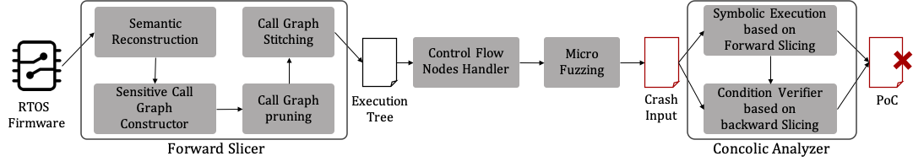

# SFuzz
Implementation(Source code) of paper: 

**SFuzz: Slice-based Fuzzing for Real-Time Operating Systems.**
*In Proceedings of the 29th ACM Conference on Computer and Communications Security (ACM CCS 2022).*

## Overview of SFuzz


## Setup
To get the docker image directly, go to: https://drive.google.com/file/d/1gSw9QFLuntsqoQlI_KjzoI8bej8ZT-E7/view?usp=share_link

## Static Analysis
Perform taint analysis on the specified firmware, slice and patch the program for the taint analysis results.

This part uses the firmware collection in the evaluation_set folder as input.

### Instructions for running this tool

1. Download Ghidra (we use version 9.2.3).
2. Change MAXMEM=2G to MAXMEM=4G in the analyzeHeadless file in the support directory of Ghidra folder.
3. `sudo apt install openjdk-11-jdk`
4. Place each file in a specific directory according to run.sh or modify run.sh according to the file location.
5. Run run.sh for a single firmware or run run_all.py for the entire firmware set.

### Directories
```
├── README.md
├── findbase         #  Tool to discover the base address for firmware loading
├── unstrip          #  Tool for recovering the symbols of a specific function in unsigned binary
├── unstrip_from_log #  Tools for recovering function symbols based on information in the log function
├── statistics_script#  Scripts for supporting statistics
├── evaluation_set   #  Unpacked firmware collection
├── findtrace_output #  Static analysis results for firmware in evaluation_set
├── findtrace.py     #  Ghidra script that performs taint analysis and outputs slices and patches
├── run.sh           #  Shell scripts for processing individual firmware
├── run_all.py       #  Python script for batch processing of multiple firmware
└── setbase.py       #  Ghidra script for setting the base address for firmware loading
```

### Run

#### For processing individual firmware
**Be sure to modify run.sh according to the actual file location before you run it**
```
sudo ./run.sh firmware_path  arch  base_addr
```
example: 
```
sudo ./run.sh evaluation_set/DIR-100/30_DIR100 MIPS:BE:32:default 0x80000100
```
#### For batch processing of multiple firmware
```
sudo python3 run_all.py
```
#### Output
Most of the files end with an underscore and a number, which represents the number of the call tree corresponding to the current file.
```
30_DIR100_result/
├── call_checksum_0  # Address of checksum function calls
├── .......
├── call_checksum_7
├── calltrace_0      # Results of call trace in call tree
├── ........
├── calltrace_7
├── cbranch_info_0   # Jumping information at the branch
├── ........
├── cbranch_info_7
├── dict_0           # String information on the call tree (used to add to the AFL dictionary)
├── ........
├── dict_7
├── exec_0           # Contextual information used for fuzzing (source address and sink address, etc.)
├── ........
├── exec_7
├── patch_0          # Patch results for function calls or branches
├── ........
├── patch_7
├── sink_buf_0       # Information about the sink function address and its corresponding buffer
├── ........
├── sink_buf_7
├── stack_retaddr_0  # Return address information on the stack
├── ........
├── stack_retaddr_7
├── summary          # Statistical Information
├── summary.json
├── xalloc_0         # Cross-reference information for the alloc function
├── ........
└── xalloc_7
```

## Dynamic Analysis
Dynamic analysis includes fuzzing and concolic solving.

This project relies on the output of the static analysis as input.

### Running environment configuration
```bash
apt-get install -y libc6-armel-cross gcc-arm-linux-gnueabi libc6-mipsel-cross gcc-mipsel-linux-gnu
apt-get install -y build-essential python3-dev automake cmake git flex bison libglib2.0-dev libpixman-1-dev python3-setuptools python python-setuptools
apt-get install -y lld llvm llvm-dev clang
apt-get install -y gcc-$(gcc --version|head -n1|sed 's/\..*//'|sed 's/.* //')-plugin-dev libstdc++-$(gcc --version|head -n1|sed 's/\..*//'|sed 's/.* //')-dev
apt-get install -y python3-pip 

git clone https://github.com/AFLplusplus/AFLplusplus.git
cd AFLplusplus
make all && make install

git clone https://github.com/Battelle/afl-unicorn
cd afl-unicorn/unicorn_mode

wget https://bootstrap.pypa.io/ez_setup.py -O - | python
sed -i '120,122d' ./build_unicorn_support.sh
wget https://github.com/unicorn-engine/unicorn/archive/refs/tags/1.0.3.zip
unzip 1.0.3.zip && rm 1.0.3.zip && mv unicorn-1.0.3 unicorn
./build_unicorn_support.sh

pip3 install --upgrade "pip<21.0.0"
pip3 install pwntools==4.8.0
pip3 install angr==9.2.6
pip3 install tqdm
```
There are also minor modifications to the dependent projects.

https://amusing-aluminum-be0.notion.site/d0de68137f884c1984d4ae7c762b566f

Also, AFL requires: if in a docker environment, execute with root privileges outside the docker environment, otherwise execute the following statements directly with root privileges.

```bash
echo core > /proc/sys/kernel/core_pattern
```

### build fuzz loader
in `./dynamic_analysis` dir (in `./uniFuzzGo` dir in docker):

`make` or `make "UFDBG=-DUF_DEBUG -g"`

### run
in `./dynamic_analysis` dir (in `./uniFuzzGo` dir in docker):

```bash
(in tmux session)
python3 ./hybrid_all.py <device findtrace output dir>  <device firmware path>
./clean.sh
python3 count.py <binary name>
```

example:
```bash
python3 ./hybrid_all.py ~/findtrace_output/2834_AC11_result ~/evaluation_set/Tenda_AC11/2834_AC11
./clean.sh
python3 count.py 2834_AC11
```