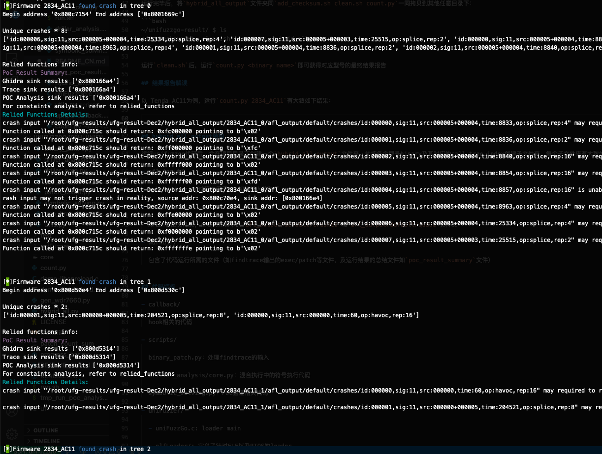

# unifuzzGo

本项目需要依赖于同属RTOS项目的[findtrace repo](https://github.com/m4yfly/findtrace)的输出作为输入

## 运行环境配置

```
apt-get install -y libc6-armel-cross gcc-arm-linux-gnueabi libc6-mipsel-cross gcc-mipsel-linux-gnu
apt-get install -y build-essential python3-dev automake cmake git flex bison libglib2.0-dev libpixman-1-dev python3-setuptools python python-setuptools
apt-get install -y lld llvm llvm-dev clang
apt-get install -y gcc-$(gcc --version|head -n1|sed 's/\..*//'|sed 's/.* //')-plugin-dev libstdc++-$(gcc --version|head -n1|sed 's/\..*//'|sed 's/.* //')-dev
apt-get install -y python3-pip 

git clone https://github.com/AFLplusplus/AFLplusplus.git
cd AFLplusplus
make all && make install

git clone https://github.com/Battelle/afl-unicorn
cd afl-unicorn/unicorn_mode

wget https://bootstrap.pypa.io/ez_setup.py -O - | python
sed -i '120,122d' ./build_unicorn_support.sh
wget https://github.com/unicorn-engine/unicorn/archive/refs/tags/1.0.3.zip
unzip 1.0.3.zip && rm 1.0.3.zip && mv unicorn-1.0.3 unicorn
./build_unicorn_support.sh

pip3 install --upgrade "pip<21.0.0"
pip3 install pwntools==4.8.0
pip3 install angr==9.2.6
pip3 install tqdm
```

另，AFL需要：如果在docker环境中，请在docker环境外以root权限执行，否则直接以root权限执行下列语句：

`echo core > /proc/sys/kernel/core_pattern`

另外对依赖的项目还需要做一点小的修改：

https://amusing-aluminum-be0.notion.site/d0de68137f884c1984d4ae7c762b566f

直接获取docker镜像请前往：https://drive.google.com/file/d/1tNDaHhYV_K5ys3M9VoBI_l6oj004too_/view?usp=sharing 其中的代码需要git pull更新一下

## 编译fuzz loader

`make` 或 `make "UFDBG=-DUF_DEBUG -g"`

## 运行

在项目根目录下

```
(in tmux session)
python3 ./hybrid_all.py <device findtrace output dir>  <device firmware path>
```

即可，如

`python3 ./hybrid_all.py ~/findtrace_output/2834_AC11_result  ~/evaluation_set/Tenda_AC11/2834_AC11`

运行完毕后，将`hybrid_all_output`文件夹同`add_checksum.sh clean.sh count.py`一同拷贝到其他任意目录下：

```bash
~/unifuzzgo-result/ $ ls
add_checksum.sh  clean.sh  count.py  hybrid_all_output
```

运行`clean.sh`后，运行`count.py <binary name>`即可获得对应型号的最终结果报告

## 结果报告解读

以 Tenda AC11为例，运行`count.py 2834_AC11`有大致如下结果：



对于有Found Crash的tree，会有相应的PoC Result Summary和Relied Functions Details内容

PoC Result Summary中的每一行表示：

- Ghidra sink results：静态分析找到的sink函数地址

- Trace sink results：混合fuzzing能找到漏洞的sink函数地址

- POC Analysis sink results：PoC验证后能找到漏洞的sink函数地址

因此Trace sink results的数量为hybrid fuzzing去重后的漏洞数目，POC Analysis sink results数量为PoC验证后每个tree中最终得到的漏洞sink地址。

因此判断工具的漏/误报请以*POC Analysis sink results*的结果为准。

另：对于Trace sink results中有的sink但POC Analysis sink results中没有的情况，一般是由于分析时间过长，设置了定时强制结束分析导致的原因。

## hybrid_all_output结构

运行unifuzzgo代码后，会在项目目录下创建一个`hybrid_all_output`文件夹，并按各个型号binary及其对应的call tree index创建子文件夹，每个子文件夹有大致如下的目录结构：

- afl_input/

  hybrid fuzzing过程中用于AFL初始输入的种子

- afl_output/

  AFL的输出文件夹，主要关注其下的`afl_output/default/crashes`和`afl_output/default/queue`文件夹

- workdir/

  包含了代码运行所需的文件（如findtrace输出的exec/patch等文件，及运行结果的总结文件如`poc_result_summary`文件）


## 代码结构

- callback/

  hook相关的代码

- scripts/

  binary_patch.py：处理findtrace的输入
  
  driller_analysis/core.py：混合执行中的符号执行代码
  
  symbolic_solving.py：POC验证相关代码

- uniFuzzer/

  - uniFuzzGo.c: loader main
  
  - elfLoader/: 定义了针对ELF以及RTOS的loader
  
- hybrid_all.py

  大规模测试时的顶层代码，会开多进程并发

- run.sh

  单个型号/小型测试时的脚本，核心是让loader跑AFL unicorn，在大规模测试中会再被hybrid_all.py所调用=.=这块写的比较丑陋

- progress_bar.py

  大规模测试时候打印进度条用的脚本
