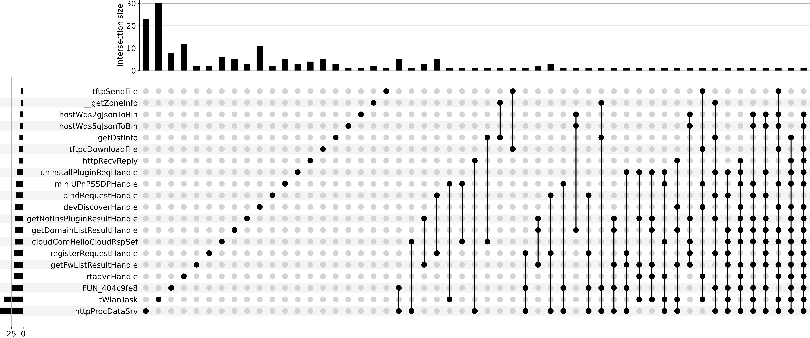

**Figure 1: Intersection of different functionality snippets.** UpSet plots the intersections of a set as a matrix. Each row corresponds to a function
set, and each column corresponds to one segment in a Venn diagram, as indicated in the figure. Cells are either empty (light-gray), meaning
that this set is not part of that intersection, or filled, showing that the set is participating in the intersection. The first column corresponds to
the elements that are only in set httpProcDataSrv (not in devDiscoverHandle or tftpSendFile)

