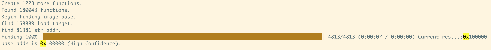

# findbase
Tool to discover the base address for firmware loading
Currently tested on arm 32-bit small-side, ppc 32-bit large-side, and mips 32-bit small-side and so on

## Usage
```
usage: findbase [options] target
 -a,--accurate             Find in accurate mode (Slow).
 -c,--create               Whether create a project for binary.
 -f,--file <arg>           File name in Ghidra project.
 -l,--language_id <arg>    Language id like x86:LE:32:default
 -O,--output <arg>         Path to save result.
 -p,--project_path <arg>   Path to create project.(Default:tmp)
```
Reference commands：
```
-f 7660sys tmp/7660sys_symboled.rep
-l ARM:LE:32:v7 -c libs/image_vx6_arm_little_endian.bin
-l PowerPC:BE:32:default -c libs/image_vx5_ppc_big_endian.bin
-l MIPS:BE:32:default -c libs/54B5
```

## How to compile

Download Ghidra, use the buildGhidraJar script in the Ghidra support directory to generate ghidra.jar, put ghidra.jar into the lib directory, then install gradle and use the gradle jar command to compile the current project

## Example
image_vx6_arm_little_endian.bin  0x00f2003fe4
image_vx5_ppc_big_endian.bin  0x0000010000
MERCURY M6G(mipsle)  0x80008000

linksys LGS308 (arm little endian) 0x100000

Cisco SG300 (arm little endian) 0x100000

