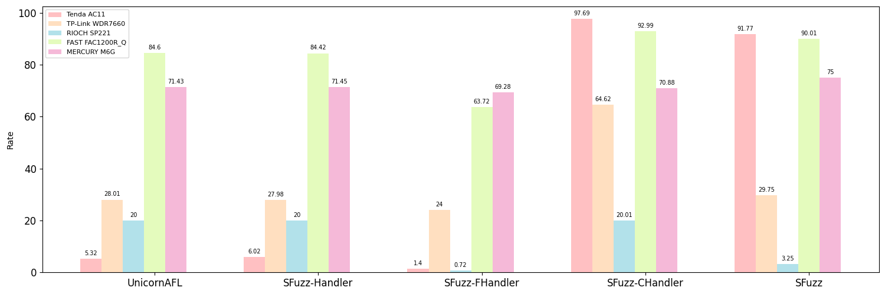

**Figure 2:** Statistics of success simulation rate among different configurations, simulations meet unexpected crash are considered as
unsuccessful. Figure 2 demonstrates the success simulation rate that provides a comparison on success rate among different tools.

